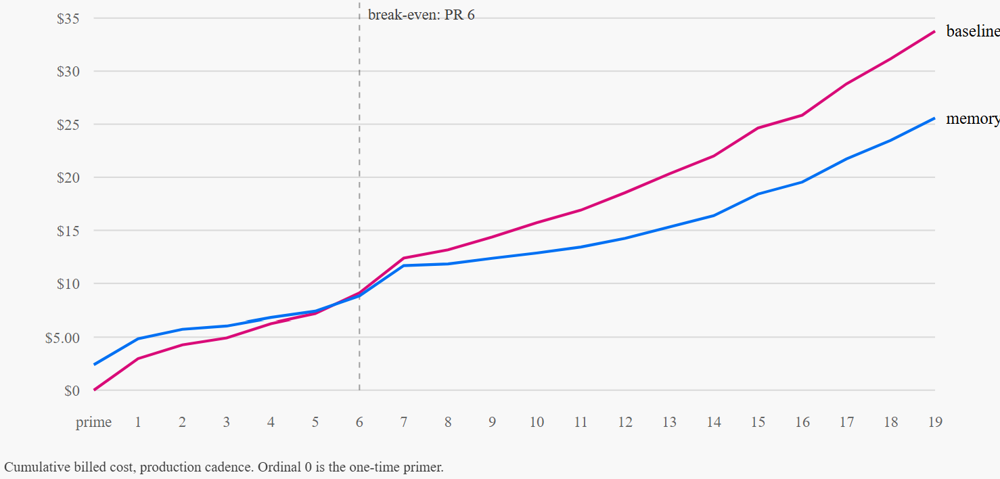

# Does agentic memory make PR review cheaper?

A **demo and experiment**, not a product. Two PR-review agents review the same
frozen sequence of 19 real `redis/redis-py` pull requests under an identical
model, prompt, tool set and effort level. The only difference between them is a
memory layer.

**The claim:** rebuilding an understanding of the repo is the largest recurring
line item in a review agent's token bill, and memory converts it from a *per-PR*
cost into a *per-repo* cost. Prompt caching cannot do that — its longest TTL is
one hour, and no real PR cadence fits inside that.

**The deliverable** is that claim measured, with the instrumentation exposed
rather than hidden behind a hero chart: two token series, a break-even PR number,
and a quality guardrail reported even when unflattering.

---

## How it works

```
        frozen sequence: 19 real redis-py PRs, pinned at 7021617890d4
                                    |
                                    v
   +---------------------------------------------------------------+
   |  ONE SHARED HARNESS: same model, prompt, effort, no tools,     |
   |  sequential, memory agent first on every PR                    |
   +---------------------------------------------------------------+
                |                                       |
                v                                       v
   +-------------------------+          +-------------------------+
   |   BASELINE  (control)   |          |   MEMORY  (treatment)   |
   +-------------------------+          +-------------------------+
   | repo conventions        |          | repo conventions        |
   | FULL SOURCE of every    |          | RETRIEVED MEMORIES for  |
   |   touched file          |          |   the touched modules   |
   | the diff                |          | the diff                |
   +-------------------------+          +-------------------------+
                |                         ^      |          ^
                |                retrieve |      | write    | prime
                |                         |      v          | (once
                |                       +--------------------+ per
                |                       | Redis Agent Memory | repo)
                |                       |  repo_convention   |
                |                       |  review_finding    |
                |                       +--------------------+
                |                                       |
                +-------------------+-------------------+
                                    v
        claude-opus-5 -- exact token usage returned on every call
                                    v
        append-only ledger: {agent, pr_id, pr_ordinal, phase}
                                    v
        context volume  |  billed cost, net of memory overhead
        break-even PR   |  cache integrity  |  quality guardrail
                                    v
                       report.json  -->  replay page
```

The substitution in the middle *is* the experiment: the baseline reads full
source to rebuild what it already knew last PR; the memory agent reads a
distilled slice of it. Both read the same diff, because neither can avoid that.

Every prompt is reproduced verbatim in **[docs/prompts.md](docs/prompts.md)**,
generated from the source with a test that fails if it drifts — "the only
difference is a memory layer" is a claim about prompts, so it should be
checkable without reading Python.

---

## Results



*Run-2, cumulative billed cost at production cadence. Ordinal 0 is the one-time
primer, which is why the memory agent starts in the red; the lines cross at PR 6
and the widening gap after it is the per-review saving compounding. Read the
**slope**, not the endpoint — the endpoint ($33.77 against $25.59) is partly a
function of how many PRs are in the sequence, and the sequence-independent number
is the per-review one below.*

**To see this live** — every chart, both runs, the per-PR accounting table and the
quality panel:

```bash
cd web
npm install        # first time only; set npm_config_cache if ~/.npm is unwritable
npm run dev        # http://localhost:5173
```

The page reads `web/public/runs.json` and the per-run reports beside it, which are
committed — so it renders the real runs with no API key, no credentials and no
network. Use the run switcher to compare run-1 against run-2.

**Two complete runs**, 19 PRs each, both agents, the same config fingerprint
(`bd49dcd2fae0fe0d`). They differ in exactly one thing — how memory is
retrieved — and the replay page renders both against the no-memory baseline.

| | retrieval | saving per review | worst PR | break-even |
|---|---|---|---|---|
| [run-1](runs/frozen/run-1) | one pooled search, 20-record budget | +27.7% | **−46.8%** | PR 5 |
| [run-2](runs/frozen/run-2) | one search per memory type, 10 each | **+31.6%** | **+6.8%** | PR 6 |

**The interesting number is the worst PR, not the average.** Splitting the budget
moved the mean 3.9 points but moved PR #4131 by **53.6** — from memory costing
47% *more* than no memory to costing 7% less. Context read per review barely
changed (59.4% → 59.5%), so this is not "memory read less": it is that the
*composition* of what it read improved on the one PR where composition decided
the outcome. #4131 gives the baseline unusually little to re-derive, so injected
memory has to earn its place there, and capping conventions at 10 instead of
letting them take all 20 slots is exactly the change that would help.

Two caveats on that comparison, because it is two runs and not an experiment
with replicates: run-2 also re-ran the primer, which is non-deterministic (100
conventions against run-1's 102, $2.39 against $2.15), and the two baselines
billed differently ($33.54 against $32.67) despite reading **byte-identical**
context — 3,890,269 tokens in both, which is the reproducibility check that the
control is unchanged. So the 3.9-point gain is suggestive, not attributed.

The numbers below are run-1's unless stated; run-2's are in
[runs/frozen/run-2/summary.json](runs/frozen/run-2/summary.json).

### The headline is per review, because a cumulative figure is not a property of the technique

**A review costs 28% less with memory, and the one-time primer pays for itself
in 4.5 reviews.**

Both numbers are size-weighted and primer-excluded, so neither depends on how
many PRs happen to be in the sequence:

| per review, primer excluded | value |
|---|---|
| cost saving, size-weighted | **+27.7%** ($0.477 of $1.719) |
| the typical (median) PR | +34.4% |
| context read | **+59.4%** less |
| worst single PR (#4131, the false-positive trap) | **−46.8%** — memory cost *more* |
| best single PR (#4059) | +79.7% |
| one-time primer | $2.15 = **4.5 reviews** to pay back |

Quote the size-weighted 27.7%, not the unweighted mean of per-PR percentages
(31.4%). The unweighted mean gives a 300-line PR the same vote as a
12,000-line one, and memory helps proportionally more on small PRs — so it
flatters the result. And quote the worst PR alongside the average: on the
false-positive trap the memory agent spent more and reviewed no better, which a
mean hides.

**Why the cumulative number is the wrong headline.** A cumulative saving is a
per-review saving, a setup cost, and an arbitrary sequence length glued
together. Only the first is a property of the technique. Over these 19 PRs:

| | context volume | output | billed | net |
|---|---|---|---|---|
| baseline | 3,890,269 tok | 535,048 tok | $32.67 | — |
| memory | 1,890,035 tok | 661,822 tok | $25.76 | $6.91 cheaper (21%) |

That 21% is the 27.7% per-review saving *minus* the primer it is still paying
off, and it moves with N — which is why it is reported but not led with:

```
N=5   +3.6%      N=12  +22.9%
N=8  +14.0%      N=15  +23.9%
N=10 +18.5%      N->inf  +27.7%
```

- Every figure is net of every memory cost: the primer ($2.15), the distilling
  write phase ($1.01), and retrieval (0 model tokens — searches are not model
  calls). A gross saving is not a result.
- **Break-even at PR 5**, in both the as-measured and production-cadence
  regimes ($6.91 and $6.85 net) — which is just $2.15 ÷ $0.477 restated.
- Even the marginal figure is not fully sequence-independent: it drifts with
  PR-size mix, measuring 33.0% over the first 11 PRs and 27.7% over all 19,
  because the back half holds the biggest diffs. Anyone quoting 28% should add
  "on a sequence whose median PR touches 8 files".
- **Halving the input did not halve the bill, and the gap is arithmetic rather
  than an accounting error.** Output is priced 5× input, so output is 41% of the
  baseline's bill and 64% of the memory agent's — which leaves the input side as
  only **59% of what the baseline spends**. Cutting context in half therefore
  cannot cut the bill in half: it applies to that 59% and no more, a 30% ceiling
  before anything else happens — and the memory agent then hands $3.17 back by
  generating **24% more output**. (Two context figures appear in this README and
  they are not the same measurement: **51%** is the sequence total with the
  primer counted, **59.4%** is per review with it excluded.) Serialized findings are only ~13k and ~17k of those output totals,
  so ~97% of output on both sides is thinking: the memory agent is not writing
  longer reviews, it is reasoning more per review. The plausible mechanism is
  that retrieved memories hand the model more leads to chase, and at this
  precision many of those leads are false. Consequence for anyone optimizing
  this: **effort, not retrieval, is the dominant cost knob** (spec §7g).

### The per-review gap, and where it collapses

The median review prompt is **167k tokens for the baseline against 44k for the
memory agent**. The ratio is not uniform, and sorting the sequence by diff size
shows why — it tracks diff size almost monotonically:

| PRs by diff size | baseline reads | memory reads | ratio |
|---|---|---|---|
| the 5 largest (4.5k–17k diff lines) | 242–504k | 111–347k | 1.5–2.2× |
| the 9 smallest (300–700 diff lines) | 107–171k | 17–31k | **5.4–7.6×** |

On a large diff the *diff itself* dominates the prompt, and memory cannot help:
it removes the cost of re-deriving repo understanding, not the cost of reading
the change. That is the honest ceiling on the technique. One PR inverts
entirely — on #4131 the memory agent read **more** than the baseline (56.3k
against 52.5k), because retrieval is not free and that PR gave the baseline
unusually little to re-derive.

### Quality: a guardrail that held, and a metric that needs work

Reported even though it is unflattering to both agents, and reported for both
runs because the run-to-run spread is itself the finding.

| gold set (7 PRs, 6 labelled defects, 3 traps) | run-1 base | run-1 mem | run-2 base | run-2 mem |
|---|---|---|---|---|
| labelled defects found | 1 of 6 | 3 of 6 | 2 of 6 | 2 of 6 |
| findings reported, all 19 PRs | 70 | 92 | 74 | 95 |
| findings outside the label set | 28 | 32 | 28 | 39 |
| `must_not_flag` traps flagged | 0 of 3 | 0 of 3 | 0 of 3 | 2 of 3 |
| proxy agreement with human comments (16 non-blind PRs) | 0.19 | 0.15 | 0.29 | 0.15 |

Quality did not collapse — that is the guardrail's job and it held in both runs.
Two things stop this being a measurement:

- **The run-to-run spread is as large as the between-agent difference.** Same
  dataset, same prompts, same fingerprint: the baseline's labelled-defect count
  moved 1 → 2 and its proxy agreement 0.19 → 0.29 between runs on byte-identical
  input. One defect is ~17 recall points on a 6-defect label set, so no ranking
  here survives its own noise.
- **The trap metric does not yet measure what it claims.** Matching is
  positional — file plus a ±5-line window — so a trap labelled with no line
  degrades to "did the agent mention this file at all". Both of run-2's flagged
  traps are that case: a nit about an uncalled method (#4131) and a
  genuine-looking bookkeeping concern at line 380 (#4177), neither of which is
  the labelled "revert not covered on disconnect" pattern. So `2 of 3` is not
  evidence that memory began re-flagging the trap; it is evidence the labels need
  line numbers or text-level matching before the false-positive beat can be
  scored at all.

"Findings outside the label set" is likewise not a precision figure: the gold set
labels 6 defects, so a finding outside it is unlabelled, not wrong.

### Prompt caching turned out to be inert, and that is a finding

An `xhigh` review of a 200k-token prompt takes 6–8 minutes, so the two agents'
calls on one PR land 6.2 minutes apart against a 5-minute TTL. Both agents write
the shared 7,066-token prefix and neither ever reads it: 18 byte-stable repeats
in run-1 (10 baseline, 8 memory) and 21 in run-2 missed the cache purely because
the entry had expired.
That is why the as-measured and production-cadence nets are within $0.06 of each
other — and it is direct evidence for the argument above. Caching could not
bridge two back-to-back reviews of the *same* PR, let alone a real PR cadence.
Buying the 1-hour TTL to fix it would cost a 2× write premium and make the
replay less like production, not more (spec §7e).

### What the runs exposed about the memory layer itself

Both of these are results, not defects to hide:

- **The retrieval window is fixed while the store grows.** `limit: 20` returned
  exactly 20 records on *every* PR from the first onward, so injected memory
  tokens are flat at ~3.7k per PR — 70,397 total, 3.7% of the memory agent's
  input. Cost does not grow with sequence position. But a saturated window
  measures the limit, not relevance: candidate records went 102 → 198 while the
  window stayed at 20, and **retrieval precision is 19%** (74 of 380 retrieved
  memories were ever cited, with no upward trend). The managed API returns no
  relevance score, so slot 20's worth cannot even be asked about (spec §7f).
- **Splitting the budget showed what the pooled window had been doing.** Run-1
  could not say whether its 20 slots filled with conventions or with findings,
  because the ledger recorded a count and not ids. Run-2 logs ids, and with
  `conv=10,find=10` the answer is lopsided: conventions returned their **full 10
  on all 19 PRs**, while findings started at 0 and only reached their own cap
  from PR 7 onward. Conventions are what crowd a pooled window — which is the
  mechanism behind #4131 flipping. Run-2 also retrieved *fewer* records (316
  against 380) and got **more** out of them: retrieval precision 19% → 25%, on
  60,247 injected tokens instead of 70,397.
- **An append-only store turns a wrong belief into a growing one.** A false
  claim that this repo's PEP 604 unions need `from __future__ import
  annotations` (untrue — `requires-python = ">=3.10"`) was written **11 times
  across 9 PRs** by the memory agent against 3 across 3 for the baseline: the
  claim sits in the window, the model restates it, the write phase persists
  another copy, which then competes for the window. Dedup-on-write breaks that
  loop — but the implementation of it barely works, which run-2 established:
  **1 merge in 101 writes** (PR #4177; the ledger counts it as
  `deduped_writes: 1`). It keys on `(module, topic)` where `topic` is
  model-generated free text, and the model never phrases a concept identically
  twice even on the same file (`...helpers-py-python-3-9-compatibi...` in PR 5
  against `...helpers-py-python-version-compa...` in PR 9). Modules repeat
  heavily — 15 of 29 recur, `commands/core.py` nine times — so the recurrence is
  there and the *key* is what fails. This is the same mistake as the original
  unroutable-module bug: free text from a model is not a stable key. The fix is a
  semantic search over `review_finding` scoped to the module *before* writing,
  merging into any hit above a threshold — one extra round trip and zero model
  tokens, because searches are `billable=False`. A coarser key made of more model
  text will not do it: `finding_class` is free text too.
  The loop duly survived: in run-2 the memory agent restated the same false
  claim **9 times across 7 PRs** against the baseline's 2, versus 11 across 9 in
  run-1. Suppressing a refuted claim is separately `review_policy`'s job, and
  that is not built either.

---

## Status

| Piece | State |
|---|---|
| Harness, both agents, primer, memory client, quality scoring | built · 255 tests · verified against live services |
| Frozen dataset | 19 PRs, pinned and cached; 7 hand-labelled; all 3 narrative beats assigned |
| **The full sequence run** | **complete, twice** — `runs/frozen/run-1` (pooled) and `runs/frozen/run-2` (split), 19/19 PRs each; both frozen |
| Replay page | renders both real runs behind a run switcher (`runs.json`); its smoke test asserts the shape from both sides |
| Gold labels | **candidate only — need a human pass** |
| Split retrieval budgets | built (`--retrieval-split`), off by default so run-1 reproduces; exercised by run-2 |
| Dedup-on-write | built (`--dedupe-writes`) but it fired **once in 101 writes** — see below. Treat as unbuilt |
| Consolidation (merging N findings into one) | not built; it spends output tokens, so it must be measured against the saving, not assumed |
| `review_policy` (procedural memory) | not built; the spec sequences it last |
| Memory invalidation for the convention-change beat | not built; spec §6 says disclose the gap rather than drop the PR |

Four caveats that belong up front rather than in a footnote:

- **The gold labels were written by Claude, and the reviewer under evaluation is
  Claude.** A label set produced by the model being measured is not an
  independent standard. They are marked `CANDIDATE` and a test asserts they stay
  marked. [docs/sequence-beats.md](docs/sequence-beats.md)
- **The gold set makes quality a guardrail, not a measurement.** 6 labelled
  defects and 3 traps across 7 PRs, and 4 of those 7 have no labelled defect, so
  recall rests on 3 PRs — one finding moves it ~17 points.
- **The measured gap is conservative in the baseline's favour.** A per-review
  source budget dropped 200 touched files that the baseline would otherwise have
  read, which lowers the baseline's cost, not the memory agent's.
- **17 of run-1's 19 PRs were restored from a checkpoint** rather than reviewed
  in one process. Their token rows come from the same append-only ledger, but the
  cache state they saw belonged to a different process. Run-2 has the mirror-image
  disclosure: a first primer attempt was superseded, so 4 calls costing $2.27 are
  real spend that is excluded from its per-PR series. Both appear in the reports'
  warnings rather than in a commit message.

---

## What keeps the result honest

Each of these is enforced in code, because violating it invalidates the
experiment. The reasoning behind each is in [the spec](docs/agentic-memory-pr-review-demo-spec.md).

- **One hashed config for both agents.** Model, effort, thinking, `max_tokens`,
  tools and system prompt are confounds if they differ; `assert_comparable()`
  raises, and the fingerprint goes in every run manifest.
- **`input_tokens` is not the prompt size** — it is the uncached remainder.
  Context volume is the sum of all three input fields.
- **Savings are always net.** Primer, retrieval and write tokens are tagged and
  counted. Tagging is a required argument, because an untagged call is an
  unmeasurable one.
- **Both cost series are reported, never just the flattering one.** "59% less
  context" and "28% cheaper" answer different questions, and quoting the first
  alone invites exactly the objection a skeptical reader should raise.
- **The headline is marginal, not cumulative**, because a cumulative saving is a
  function of sequence length — and the size-weighted aggregate is quoted over
  the unweighted mean of per-PR percentages, which runs several points higher
  for no reason but that small PRs vote as loudly as large ones.
- **Memory writes are explicit and client-side.** Automatic extraction runs on
  the memory service's own LLM, whose tokens client-side accounting cannot see.
- **Compressed replay is repriced**, under a stated rule, applied to *both*
  agents — the memory agent's primed prefix goes cold in production too.
- **The memory agent runs first**, so the free ride on the shared cache prefix
  falls to the baseline and the bias runs *against* the thesis.
- **Retrieval logs which memories came back, not how many.** A count cannot say
  whether a saturated window filled with conventions or findings; run-1's rows
  predate id logging and report `instrumented: false` rather than an empty mix
  that would read as "retrieval returned nothing". Run-2's rows are instrumented,
  which is the only reason the crowding question above has an answer.
- **The manifest records the retrieval shape and write policy**, which are not
  part of the model fingerprint — otherwise two runs differing in the single
  variable under test produce byte-identical manifests.
- **Quality is a mandatory guardrail** on its own chart. Cost and quality never
  share an axis.
- **The curation is disclosed.** `dataset table` prints per-PR recurrence, diff
  size, beat and human-comment counts. Module recurrence is 100% both before and
  after trimming, so recurrence is a property of redis-py, not of the selection.

---

## Where to look next

| Document | What it covers |
|---|---|
| [docs/agentic-memory-pr-review-demo-spec.md](docs/agentic-memory-pr-review-demo-spec.md) | **The source of truth.** Full design, every methodological defence, the open questions |
| [docs/operations.md](docs/operations.md) | Running it: setup, credentials, every command, the flags that change what is measured, run safety |
| [docs/prompts.md](docs/prompts.md) | Every prompt sent, verbatim and generated from source |
| [docs/store-provisioning.md](docs/store-provisioning.md) | The Agent Memory store: types, settings, and the API behaviours that bite |
| [docs/sequence-beats.md](docs/sequence-beats.md) | The 19 PRs, their narrative beats, and the evidence for each |
| [web/README.md](web/README.md) | The replay page: redis-ui, hand-built charts, validated palettes |
| [CLAUDE.md](CLAUDE.md) | Instructions for agents working in this repo |
